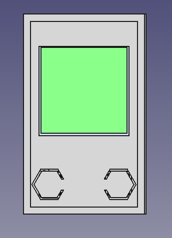

# ESPStick

ESPStick is a project that aims to turn the ESP32 into a Swiss Army Knife with infinite possibilities using MicroPython. This project is still under development, and contributions and suggestions are welcome.

## Images:
  

  
  
  
  
  
  

  

  
  
  
  
  
  

  

  
  
  
  

## Installation

1. Load the `esp32_display.bin` firmware to your ESP32 board (we recommend using the Lolin32 Lite).
2. Clone this repository.
3. Upload the files inside the `src` folder to the root directory of your ESP32 board.

## Equipment

1. Lolin32 Lite 4mb
2. Display GMT130 ST7789 (compatible) 240x240 1.3"
3. Two push-buttons
4. Battery 850mAh (the one I had on hand)
5. IR-LED (not implemented but installed)
6. LED W2812B (not implemented but installed)

### Features

## Features
- Safe Mode:
  - During boot, press and hold `button2` defined in config.py to activate safe mode. This will start the `access point (AP)` mode with the following settings: `SSID:ESP32` and 
    `Password:12345678`.Additionally, WebREPL will be started with the password `1234`. This mode is useful for fixing any issues that may have occurred in your code.
- WIFI
  - Automatic connection to wifi upon boot-up
  - AP (access point) mode and client mode
  - Status of the wifi connection (connected or not)
  - View IP address of the connected wifi network
  - Scan for available wifi networks (work in progress)
- Lights
  - Turn on the GPIO22 LED on the Lolin32 board
- Advanced
  - Scripts - execute any .py script compatible with MicroPython
  - Start WebRepl - the WebRepl server is active as soon as the ESP is powered on
  - Deep-Sleep - save battery power by pressing the button connected to GPIO14
  - Reboot - restart your ESP

## Future Development

This list is subject to change, but some potential future development ideas include:

1. Documentation (this is very necessary but also very time-consuming)
2. Scan wifi - create a sub-menu to view all information about the available wifi networks
3. Bluetooth
4. Add all GPIOs for control
5. Improve the Scripts section
6. Create a sub-menu with power options

Again, contributions and suggestions are welcome!
